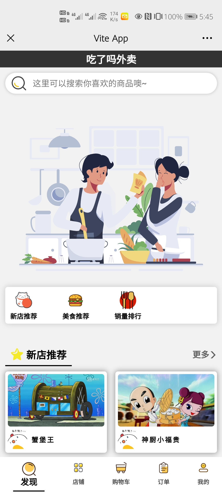
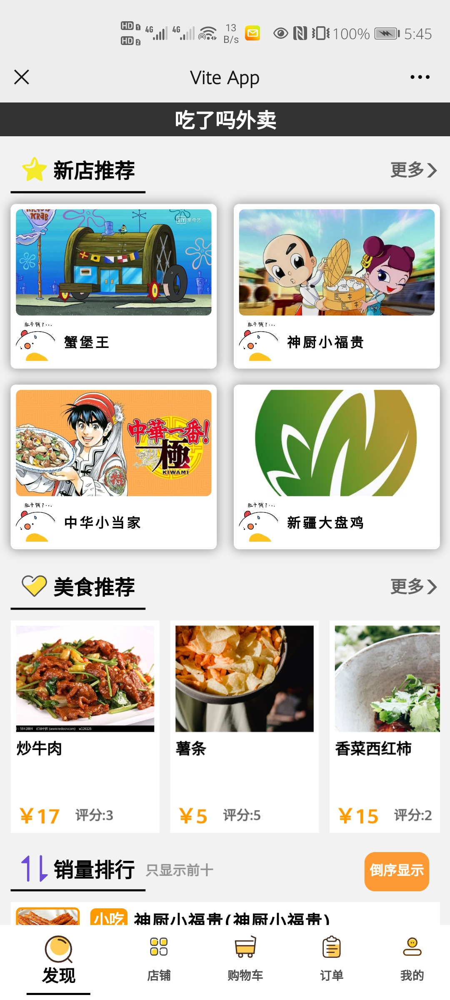

## 《吃了吗外卖》移动WebApp
> 这是一个用于外卖服务的web应用，提供于用户端，拥有人性化的页面，以及良好的交互体验，相信你一定会喜欢它的！
### 一、介绍
> * <b>作者</b>:薛定谔的猫 🍉 
> * 当前大三学生
> * 对技术抱有热情心
> * <b>制作这个App的初衷</b>: 这个应用所用的UI框架Vue为当前最新版Vue3,制作此应用的目的也是为了自身学习和进步,利用Vue提供的组件化以及数据响应式,创建一个单页面应用。没有用到任何的组件库，页面组件均为原生实现，同时也是为了更好的熟悉和手写CSS。
### 二、包含的技术栈
* HTML
* CSS
* Sass
* JavaScript
* Vue全家桶: 
  1. vue-router(路由管理) 
  2. vuex(状态管理) 
* axios库
>以上技术栈为当前正在使用中的，不包括以后所引入的技术栈
### 三、当前进度
#### 1.已完成功能
* 1. xxxxxx
#### 2.界面展示
##### 1. 首页

     

##### 2. 店铺列表和商品分类
   

##### 3. 购物车

    

##### 4. 订单

#####  5.结算页面

##### 6. 个人中心

   

##### 7. 商品详情

   

##### 8. 用户登录

##### 9. 用户注册

### 四、开发日志
* <b>2021/5/29:</b> 
  1. 完成列表滑动删除组件的封装
  2. 购物车跳转结算页面，以及结算页面的编写
* <b>2021/5/30:</b> 
  1. 首页、结算页面样式优化
  2. 新增选择店铺页面，以及商品分类页面跳转
* <b>2021/5/31:</b> 
  1. 部分页面样式优化
  2. 新增店铺商品页面
* <b>2021/6/7:</b> 
  1. 新增添加地址功能,
  2. 修复付款时，判断是否填写地址功能
  3. 修复店铺商品页面商品加入订单时的问题
  4. 优化订单删除功能
  5. 新增订单和地址列表为空时，显示提示信息
